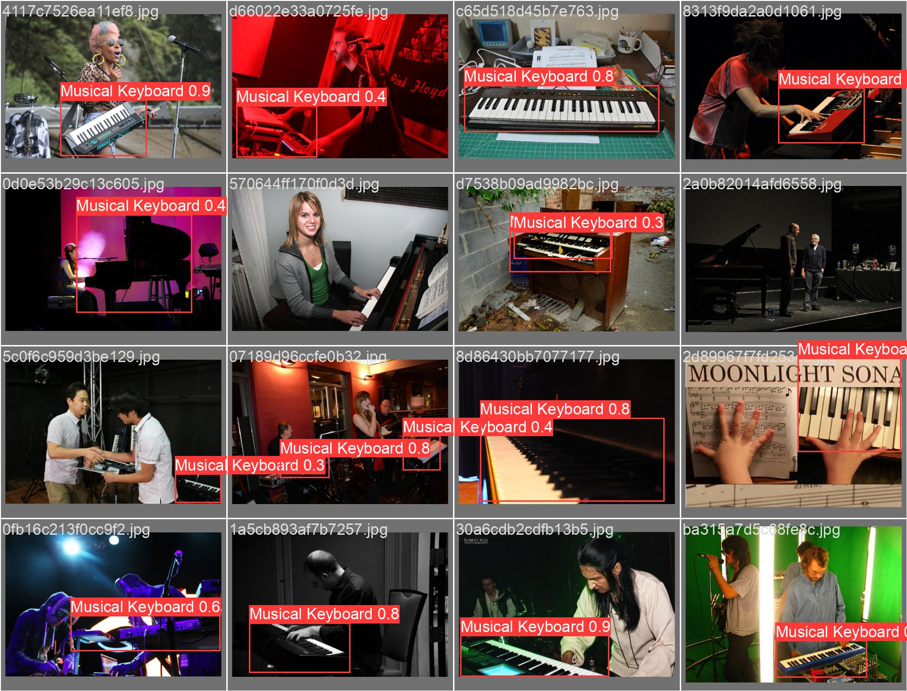

# Automatic Piano Detector
This is a script for fine-tuning the 
[YOLOv8](https://github.com/ultralytics/ultralytics)
model on a subset of the 
[Open Images Dataset](https://storage.googleapis.com/openimages/web/index.html)
for piano detection.
The scripts directory contains scripts for downloading all the training 
and validation data, training the model, and doing inference on a 
directory of videos.

**Example model outputs**:


## Using the Model:
The model weights can be downloaded from the releases page [here](https://github.com/Chromeilion/piano-detector/releases/latest). 
The best resource on performing inference can be found on the YOLO docs 
in the [predict](https://docs.ultralytics.com/tasks/detect/#predict) section. This repo also provides a script for 
inference on videos which you can look at under ```scripts/inference.py```.

## Using the Scripts
To run the scripts included in this repository simply make sure you have 
all the dependancies listed in requirements.txt. This can be done with 
the following command:
```bash
pip install -r requirements.txt
```
Then run any script you want with python, for example:
```bash
python scripts/download_dataset.py
```
All configuration for the scripts can be found in config.py.

## Credits:
YOLOv8:
 - Jocher, G., Chaurasia, A., & Qiu, J. (2023). YOLO by Ultralytics 
   (Version 8.0.0) [Computer software]. https://github.com/ultralytics/ultralytics

Open Images Dataset:
 - Krasin I., Duerig T., Alldrin N., Ferrari V., Abu-El-Haija S., Kuznetsova A., Rom H., Uijlings J., Popov S., Kamali S., Malloci M., Pont-Tuset J., Veit A., Belongie S., Gomes V., Gupta A., Sun C., Chechik G., Cai D., Feng Z., Narayanan D., Murphy K.
   OpenImages: A public dataset for large-scale multi-label and multi-class image classification, 2017.
   Available from https://storage.googleapis.com/openimages/web/index.html.